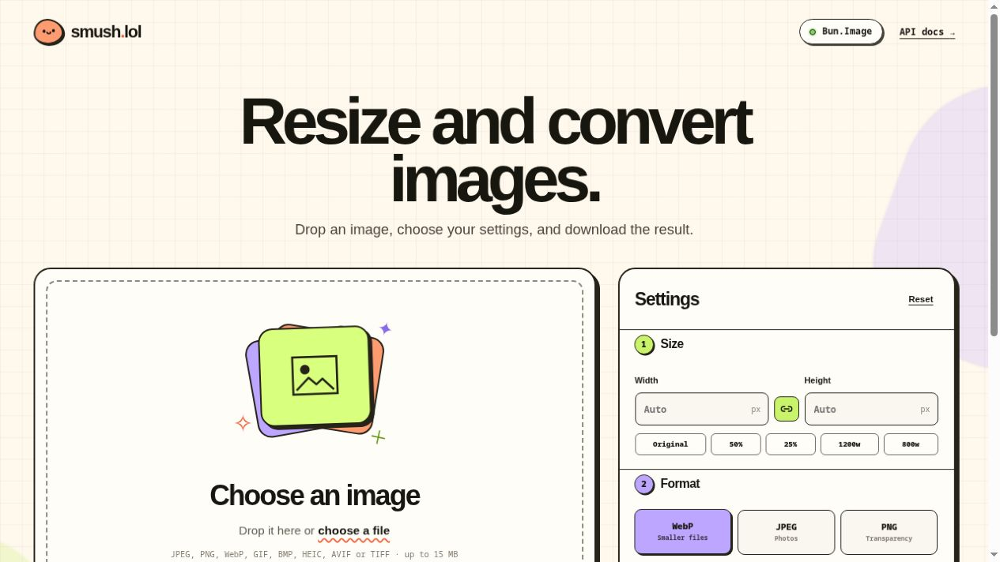
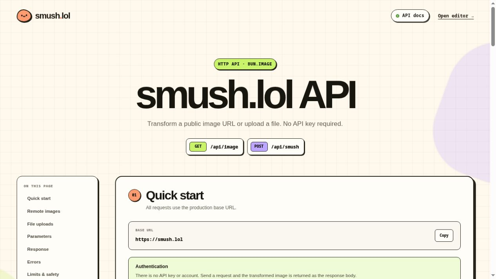

<p align="center">
  <a href="https://smush.lol">
    
  </a>
</p>

<p align="center">
  <strong>A cheerful, no-account image workbench powered by Bun.Image.</strong><br />
  Resize, transform, and convert images without Sharp or a native add-on.
</p>

<p align="center">
  <a href="https://smush.lol"><strong>Open the app</strong></a>
  &nbsp;·&nbsp;
  <a href="https://smush.lol/docs">API docs</a>
  &nbsp;·&nbsp;
  <a href="https://bun.com/docs/runtime/image">Bun.Image</a>
</p>

<p align="center">
  <a href="https://smush.lol">
    
  </a>
</p>

## What it can do

- Batch-convert up to 50 exports (150 MB of sources), with per-item cancel, retry, and downloads
- Download completed results in a ZIP with unique filenames; clear the queue to release images
- Drag, browse, paste, load a public image URL, or start with a generated demo image
- Resize up to 12,000px per side with Bun's native resampling kernels
- Crop to square, portrait, widescreen, original, or custom ratios; drag or use sliders to position the crop
- Fill transparent pixels with a chosen background color when exporting JPEG
- Rotate, flip horizontally or vertically, and adjust brightness/saturation
- Export WebP, progressive JPEG, or PNG
- Start with Web, Email, or Lossless export presets
- Save, reuse, update, and delete up to 20 named recipes in this browser; old saved settings migrate automatically (no images or URLs are saved)
- Queue multiple widths and formats from one source, with descriptive download filenames
- Copy a converted image as PNG into a document or chat, from the editor or queue
- Keep chosen settings when replacing an image; use Reset to return to defaults
- Inspect original and converted images with a keyboard-accessible comparison slider
- Set a target file size for JPEG or lossy WebP; quality adjusts without silently resizing
- Tune quality, lossless WebP, PNG compression, palette colors, and dithering
- Preview before/after size and dimensions, then download the result
- Copy a reusable transformation URL for remote images
- Process images only in memory; no files or metadata are stored

Uploads are capped at 15 MB and 48 megapixels. JPEG, PNG, and WebP are portable across Railway's Linux runtime. Bun can also decode the first frame of GIFs and handle BMP; HEIC, AVIF, and TIFF support depends on the host platform.

## Stack

- Bun 1.4 runtime, package manager, test runner, and browser bundler
- Elysia 1.4 for the HTTP server and typed multipart validation
- `Bun.Image` for metadata, transforms, and encoding
- Plain TypeScript and CSS in the browser
- Railway via a pinned Bun 1.4 Docker image

## Run locally

Install [Bun 1.4](https://bun.com/get), then:

```bash
bun install
bun run dev
```

Open [http://localhost:3000](http://localhost:3000). To use another port:

```bash
PORT=4317 bun run dev
```

Quality checks:

```bash
bun run typecheck
bun test
bun run build
```

## API

The complete browser-friendly API reference is available at [smush.lol/docs](https://smush.lol/docs).

<p align="center">
  <a href="https://smush.lol/docs">
    
  </a>
</p>

### Transform a remote image

`GET /api/image` accepts a public HTTP(S) image URL and transform options as query parameters. The response is an inline image suitable for an `` tag:

```text
https://smush.lol/api/image?url=https%3A%2F%2Fexample.com%2Fphoto.jpg&width=800&format=webp&quality=82
```

```html

```

Remote sources are limited to 15 MB, three redirects, and a ten-second fetch. Localhost, private-network addresses, credentials, non-web protocols, and nonstandard ports are rejected. Redirect destinations are checked again before they are fetched.

### Transform an upload

`POST /api/smush` accepts `multipart/form-data` with an `image` file and optional transform fields:

| Field | Values | Default |
| --- | --- | --- |
| `width`, `height` | `1`–`12000` | source size |
| `fit` | `inside`, `fill` | `inside` |
| `filter` | `lanczos3`, `mitchell`, `nearest`, and other Bun filters | `lanczos3` |
| `rotate` | `0`, `90`, `180`, `270` | `0` |
| `flip`, `flop` | boolean form values | `false` |
| `brightness`, `saturation` | `0`–`3` | `1` |
| `format` | `webp`, `jpeg`, `png` | `webp` |
| `targetKB` | `1`–`15360`; JPEG / lossy WebP, 1024 bytes per KB | none |
| `quality` | `1`–`100` | `82` |

Both endpoints support the same transform fields. The response body is the transformed image. Headers include the output dimensions, format, Bun version, and a safe output filename.

## Deploy on Railway

Railway's current Bun guide recommends a Dockerfile because Railpack does not auto-detect Bun projects yet. This repo includes:

- a multi-stage `Dockerfile` pinned to `oven/bun:1.4.0-alpine`
- `railway.json` with Dockerfile build settings, `/health` checks, and restart/draining policy
- a server that listens on Railway's injected `PORT`

From the Railway dashboard, create a project from `nearbycoder/smush.lol`, then generate a Railway domain under **Settings → Networking**. Once it is healthy, add `smush.lol` as a custom domain.

Railway will provide two DNS records:

1. A CNAME/ALIAS target such as `example.up.railway.app`
2. A TXT ownership-verification record

Add both records at the DNS host. For an apex domain, the provider must support CNAME flattening, ALIAS, or ANAME; Railway does not publish a static IP for an A record. Requests will return 404 until the TXT verification succeeds.

Cropping and JPEG background fill use the browser canvas before uploading a lossless PNG to Bun.Image. They require a browser-decodable source and apply before server resize/rotation. Prepared uploads retain the 15 MB limit. Queue crops use the same ratio and relative position on each image. `/api/source` fetches validated original bytes for remote-image previews using the same URL restrictions; it returns `no-store` responses. Browser crop/background settings are not part of reusable transform URLs.

## Privacy model

Image bytes are held only for the lifetime of the HTTP request. The server does not write uploads or remote images to disk, a database, object storage, analytics, or application logs. Upload responses use `Cache-Control: no-store`; remote transformation responses may be cached by clients for one hour.

### Private conversion and vector input

The editor and batch queue can process files entirely in the browser. Browser-only mode prevents new source-URL fetches and image API uploads; queued recipes also respect the active privacy toggle. Resetting controls or applying recipes keeps an enabled privacy toggle on. Models/codecs may still download; image bytes stay local. Browser-supported inputs include self-contained SVG paths/shapes, rasterized at the chosen output dimensions. SVG scripts, external references and embedded images are rejected.

AVIF exports always use a local jSquash WASM worker, as do local WebP exports (including lossless). Workers terminate on cancellation. PNG/JPEG use the browser encoder; resampling, progressive JPEG and PNG palette/compression controls are disabled for local processing. The HTTP API continues to support JPEG, PNG and WebP. Initial AVIF/WebP codec downloads are self-hosted under `/codecs/` and only requested when used.

### Editing tools

Background removal uses the MIT-licensed `onnx-community/BEN2-ONNX` model (pinned revision `7ec4df6`) in a cancellable browser worker. Its first use downloads approximately 219 MB from Hugging Face plus the self-hosted ONNX runtime; subsequent model loads use the browser cache. Inference can take several minutes on a CPU. Source images are limited to 12 MP for this tool, and the most recent cutout is reused when changing export settings. No image is sent to Hugging Face.

Blur/redaction supports up to 30 relative rectangular regions, applied after crop, rotation and resize. Solid black replaces the selected pixels; blur is cosmetic and should not be used to conceal sensitive information. Text and PNG-normalized logo watermarks support placement, color, width and opacity. All three tools apply to queued exports and force local processing. Recipes save editing settings but omit logo image data; add the logo again after loading a recipe.

### Contact sheets and PDF

Open **Contact sheet / PDF** to combine queued images (or the current image if the queue is empty). Choose completed exports to include applied edits, or source images for the originals. Move or remove entries to control order. Contact sheets offer 1–6 columns, filename labels and a 400–4800px width; oversized canvases are rejected before allocation. PDFs place one image per page with A4, US Letter or 96 dpi image-sized pages, portrait/landscape paper and 0–72 point margins. PDF image data is limited to 2400px per side, 50 pages and 100 MB. Generation stays local, supports cancellation, and loads the PDF library only when needed.

### Metadata and edit history

**Inspect metadata** reads the original or current export locally and shows up to 300 readable tags, including camera settings, orientation, ICC profiles and GPS coordinates when present. Download the displayed values as JSON. Raw binary payloads and thumbnails are omitted, and unsupported/malformed metadata is reported explicitly. The parser is loaded on demand.

**Undo / Redo** restores settings, crop regions, redactions and watermarks. Use the buttons or Ctrl/⌘ Z (Shift Z or Ctrl Y to redo) outside text fields and dialogs. History is bounded to 50 snapshots / 8 MB, stays in memory, and resets when replacing the source. Browser-only privacy mode is independent of undo and remains enabled through resets/recipes. Restoring settings cancels an in-flight conversion; convert again to update the output. Browser tooling dependencies are installed only in the build stage, keeping them out of the production server dependency tree.

### Image toolbox

The Image toolbox operates locally on the original source or current export. Color palette extraction samples up to 256px, excludes pixels below 50% opacity, groups similar RGB colors and exports up to 12 dominant colors as CSS variables. Percentages refer to all visible sampled pixels.

Pixel color picker supports clicking the rendered image or entering exact X/Y coordinates, displays RGBA and eight-digit HEX, and copies the selected color. Its raster is capped at 12,000px per side; alpha is preserved.

Histogram & statistics shows RGB or luminance distributions, mean luminance, transparency exclusions and black/white counts from a bounded 1024px sample. Download all 256 bins as CSV.

Print size & DPI calculates print dimensions in inches/centimeters, effective DPI at a desired width and the required pixel dimensions at a chosen DPI. It reports when the source falls short and exports a text report without altering pixels or metadata.

Favicon pack produces transparent-padded or center-cropped square PNGs at 16/32/48/180/192/512px, a three-size PNG-backed ICO, and an HTML link snippet in a ZIP. The source/export choice controls whether prior edits are included.

Social image pack exports four named dimensions (1080px square, 1080×1350 portrait, 1080×1920 story, 1200×630 landscape), individually or together. Choose center crop or contain with a custom background, and JPEG quality 90 or PNG. Every file is named with its dimensions.

Split image into tiles exports a full-resolution 1–10 row/column PNG grid with a JSON coordinate map. Integer boundaries preserve every source pixel even for uneven dimensions. Each tile must fit within 12,000px per side; encoded data is capped at 100 MB.

Sprite sheet combines up to 50 queued originals/completed exports (or the current image) into a transparent PNG atlas. Choose cell size, columns and spacing; images fit without cropping. ZIP includes numbered CSS classes and a JSON map retaining source names. Pixel and byte budgets reject oversized sheets before download.

Image finishing includes solid or transparent borders up to 1,024 pixels per side. Padding is added after resizing; saved recipes, undo/redo, and batch exports retain the settings. JPEG output flattens transparency onto the selected background.

Rounded corners use a percentage of the shorter finished edge (0–50%). They apply after borders, preserve alpha in PNG/WebP/AVIF, and use the chosen background for JPEG. Square images at 50% become circular.

Grayscale, sepia, and invert filters offer 0–100% strength. Pixel adjustments run in a cancellable worker before redaction, watermarks, and borders, preserve alpha, and carry through recipes and batch exports.
